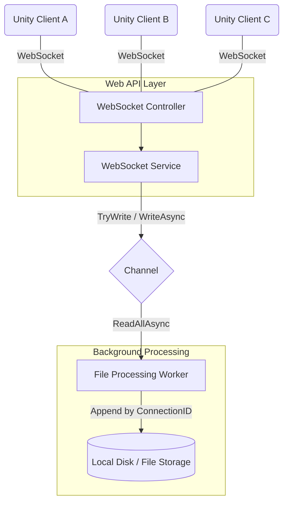

```mermaid
graph TD
    U1(Unity Client A) -- WebSocket --- C[WebSocket Controller]
    U2(Unity Client B) -- WebSocket --- C
    U3(Unity Client C) -- WebSocket --- C

    subgraph "Web API Layer"
        C --> S[WebSocket Service]
    end

    S -- "TryWrite / WriteAsync" --> B{Channel}
    B -- "ReadAllAsync" --> W[File Processing Worker]

    subgraph "Background Processing"
        W -- "Append by ConnectionID" --> D[(Local Disk / File Storage)]
    end
```