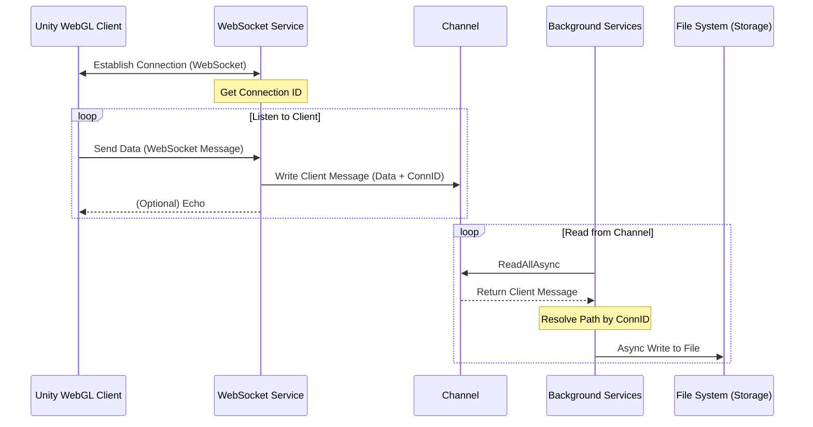

```mermaid
sequenceDiagram
    participant Unity as Unity WebGL Client
    participant Service as WebSocket Service
    participant Channel
    participant Workers as Background Services
    participant Disk as File System (Storage)

    Unity<<->>Service: Establish Connection (WebSocket)
    Note over Service: Get Connection ID

    loop Listen to Client
        Unity->>Service: Send Data (WebSocket Message)
        Service->>Channel: Write Client Message (Data + ConnID)
        Service-->>Unity: (Optional) Echo
    end

    loop Read from Channel
        Workers->>Channel: ReadAllAsync
        Channel-->>Workers: Return Client Message
        Note over Workers: Resolve Path by ConnID
        Workers->>Disk: Async Write to File
    end
```